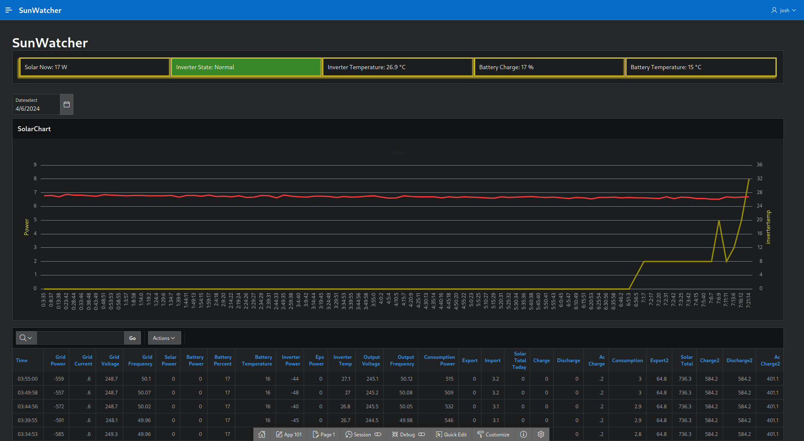

# Basic implementation for Oracle APEX of GIVENERGY's Inverter API

- Javascript populates page items from apex.server.process calls against defined AJAX Callback.
- Basic warn/alarm functionality.

